# 4C: choose an AI Harness, or build the smallest one that works

> **Point your coding agent at this repository and ask it to evaluate a
> Harness, or to design the minimum one your task needs. It will produce a
> structured answer instead of a feature-list opinion.**

A model call is not a task. A **Harness** is the engineering layer that turns
bounded, mostly stateless model calls into task execution across tools, state,
providers and time. Choosing one is currently done by reading feature lists and
star counts, which does not answer the only question that matters: does this
framework control the decisions *your* task actually forces?

4C answers that with four questions and a removal test.

## Give this to your agent

**Which Harness should I use?**

``` text
Read https://github.com/warlockee/4c-harness (README, then docs/theory.md
sections 1-4).

My task: <describe one task execution: input, success condition, effects,
required evidence, hard limits>

Using the 4C removal test, tell me:
1. which of Cost / Compatibility / Continuity / Cognition my task activates,
   and the exact policy delta that activates each one;
2. which candidate Harness fits that profile, using the comparison tables in
   the README and the evidence matrix in docs/evidence.md;
3. what machinery I should NOT adopt, and which of my requirements would have
   to change before it becomes necessary;
4. which correctness and authority checks I still own regardless of framework.
```

**Is the framework I already picked the right size?**

``` text
Read https://github.com/warlockee/4c-harness, then audit my current design
against it: <paste architecture or point at the repo>.

For every mechanism present (router, memory, checkpointer, multi-agent layer,
optimizer), name the 4C pressure that justifies it and the counterfactual that
would prove it necessary. List anything that fails the test as removable, and
anything missing that an active pressure requires.
```

**Build me the minimum Harness.** The full implementation brief is in
[Step 4](#step-4-make-the-coding-agent-prove-minimality) below. It constrains
the agent to build only what an activated pressure justifies, with tests for
the denied effect, the budget stop and the tool failure.

## What comes back

For *extract a typed record from one uploaded invoice*, the removal test
returns: Cost inactive unless the document can exceed the envelope,
Compatibility inactive at one provider, Continuity inactive at one call,
Cognition inactive with no prior runs. The correct build is one model call,
typed output validation and a token ceiling. No agent loop, no memory, no
framework. If the invoice can exceed the context window, Cost activates and you
add exactly one mechanism: a size check and a stop.

That is the shape of every answer: an activation profile, a minimum build, and
an explicit list of what not to adopt.

## The short answers

If you would rather read the conclusion than run the analysis, these are the
pre-computed profiles. They evaluate documented mechanisms, not project quality
or how good the software is to use.

| Open-source system | Cost | Compatibility | Continuity | Cognition | Best fit |
|---|---|---|---|---|---|
| [DeepSeek Harness](https://github.com/deepseek-ai/deepseek-harness) | Partial | **Strong** | **Strong** | Evidence | Plugin-native coding/agent Harness with replaceable services and an event-sourced session model. Extensibility is not automatic learning. |
| [Codex](https://github.com/openai/codex) | Partial | **Strong** | **Strong** | Evidence | Sandboxed tools, approval policy, MCP/skills and resumable sessions. Configuration and traces do not by themselves create Cognition. |
| [Gemini CLI](https://github.com/google-gemini/gemini-cli) | **Strong** | **Strong** | **Strong** | Evidence | Model routing, token caching, MCP/extensions, sandboxing, checkpointing. Broad coverage is useful only when the task activates it. |
| [OpenHands](https://github.com/OpenHands/OpenHands) | Partial | **Strong** | **Strong** | Evidence | Sandboxed execution and lifecycle control for autonomous runs. Evaluation evidence does not make the policy self-improving. |
| [Cline](https://github.com/cline/cline) | Partial | **Strong** | **Strong** | Evidence | One coding core across IDE, CLI and SDK, with checkpoints and persistent state. Multi-agent and scheduling can be unnecessary for smaller tasks. |
| [Aider](https://github.com/Aider-AI/aider) | Partial | **Strong** | Partial | Evidence | Focused terminal editing with repository maps and git-backed undo. Its smaller profile is often an advantage. |
| [browser-use](https://github.com/browser-use/browser-use) | Partial | **Strong** | Partial | Evidence | Browser execution loop with provider choice and persistent browser resources. Specialization is not general completeness. |

Adjacent architectures that can own Harness mechanisms, listed separately
because their product unit is not a terminal or IDE agent:

| Representative system | Archetype | Cost | Compatibility | Continuity | Cognition | Reach for it when |
|---|---|---|---|---|---|---|
| [LangGraph](https://github.com/langchain-ai/langgraph) | Stateful agent runtime | Partial | Partial | **Strong** | Evidence | Continuity is the dominant pressure: durable state, interrupt/resume, replay. |
| [CrewAI](https://github.com/crewAIInc/crewAI) | Multi-agent orchestration | Partial | **Strong** | **Strong** | *Adaptive* | Two or more roles genuinely need different tools, authority or context. |
| [Langflow](https://github.com/langflow-ai/langflow) | Visual workflow platform | Partial | **Strong** | **Strong** | Evidence | Composition and deployment matter more than one local agent loop. |
| [LiteLLM](https://github.com/BerriAI/litellm) | Model gateway | **Strong** | **Strong** | Partial | *Adaptive* | Cost and Compatibility dominate: budgets, routing, fallback, many providers. |

Three things this table is not saying:

- **Gemini CLI is not better than Aider** for exposing more machinery. It is
  better only when your task requires that machinery. More activated Cs mean a
  harder task, not a better product.
- **A trace or eval feature is not Cognition.** Only two systems here reach
  `Adaptive`, where prior outcomes automatically change live policy, and none
  reaches `Strong`. The rungs are defined in the
  [selection audit](docs/validation/popular-harness-selection.md#how-cognition-is-graded).
- **A product can span layers.** vLLM batching and GPU scheduling optimize
  model computation and stay Infrastructure; task-level routing or retry policy
  is Harness.

Grades: `Strong` is substantial first-class machinery, `Partial` is mechanisms
that exist while application policy does most of the work, `External` means
bring another component. Eligibility for the tables is 30k+ GitHub stars, an
OSI-approved license and activity in the prior six months; live counts and
sources are in the [selection audit](docs/validation/popular-harness-selection.md).

## The method behind the answers

Four questions, one per durable reason execution policy has to change:

| 4C | Pressure | The decision it governs |
|---|---|---|
| **Cost** | Resources are finite | Budget, route, cache, compress, parallelize or stop? |
| **Compatibility** | Systems differ | Which model, provider, tool and protocol differences need adapters or negotiation? |
| **Continuity** | Tasks unfold through time | What state, lifecycle and recovery semantics must survive one model call? |
| **Cognition** | Past runs produce evidence | Which reusable execution policy should improve from prior runs? |



Cost, Compatibility and Continuity shape current execution. Cognition is the
cross-run feedback plane that can update them.

A pressure counts only when deleting it from your task changes a decision:

| Delete this | If nothing changes | Then don't build |
|---|---|---|
| Resource scarcity: make it free, instant, unlimited | Cost is inactive | Router, cache, budget optimizer beyond one hard stop |
| Semantic difference: one provider, one tool schema | Compatibility is inactive | Adapters, capability negotiation, fallback |
| Time: one call, no history, no resume | Continuity is inactive | Checkpoint store, workflow engine, durable runtime |
| Prior experience: no past runs to learn from | Cognition is inactive | Optimizer, self-modifying loop, memory system |

"We may need it someday" does not activate anything. Only an observed policy
delta does.

It also narrows a production incident: budget exhausted, latency cliff or
context overflow is **Cost**; provider, tool or schema mismatch is
**Compatibility**; lost state, unsafe retry, runaway loop or broken resume is
**Continuity**; the same failure repeating despite accumulated evidence is a
**Cognition gap**. Wrong answers and unpermitted actions are deliberately not
inside a C; see [the minimum correctness boundary](#the-minimum-correctness-boundary).

## Build the minimum viable Harness

### Step 1: Write the task contract before choosing a framework

``` text
input          What starts one task execution?
success        What observable result means the task is complete?
effects        Which tools, files, services or people may it affect?
evidence       What current facts must the model be able to observe?
limits         What token, time, money and attempt envelope applies?
```

If these are unknown, framework selection is premature.

### Step 2: Run the four removal tests

Use the table above.

### Step 3: Add the smallest mechanism for each active C

| Active pressure | Minimum useful mechanism | Add later only when proven necessary |
|---|---|---|
| Cost | usage accounting + hard budget/stop | routing, caching, compression, speculative parallelism |
| Compatibility | typed model/tool boundary | multi-provider adapters, capability negotiation, fallback |
| Continuity | explicit state + step limit + terminal states | durable checkpoints, replay, fork, compensation, distributed workflow runtime |
| Cognition | traces + outcome labels + versioned policy artifact | automated diagnosis, optimization, rollout and rollback |

The minimal Harness is usually not a framework. It is a small execution kernel:

``` text
task input
  → assemble current evidence
  → call one model through one typed boundary
  → validate and authorize any proposed effect
  → execute, observe the outcome and update task state
  → stop on success, budget or explicit failure
  → emit a trace for later evaluation
```

Do not add multi-agent delegation until two roles require different tools,
authority or context. Do not add durable execution until a task must survive a
process boundary. Do not add model routing until resource or capability
differences change a real decision. Do not add Cognition until you can name the
versioned policy artifact that evaluation will update.

### Step 4: Make the coding agent prove minimality

``` text
Build the minimum Harness for this task:

Task contract:
- Input: <one execution input>
- Success/postcondition: <observable condition>
- Allowed effects: <tools/resources and scope>
- Required evidence: <facts the model must observe>
- Hard limits: <tokens/time/money/attempts>

4C activation:
- Cost: <inactive, or exact policy delta>
- Compatibility: <inactive, or exact semantic difference>
- Continuity: <inactive, or exact state/lifecycle requirement>
- Cognition: <inactive, or prior evidence → versioned policy artifact>

Implementation rules:
1. Start with one agent, one model path and explicit typed tools.
2. Implement only mechanisms justified above.
3. Keep application success criteria outside model self-judgment.
4. Validate tool arguments and observable postconditions.
5. Enforce effect scope independently of model output.
6. Add a hard step/budget stop and structured execution trace.
7. For every extra abstraction, state the failure it prevents and the test
   that proves the abstraction is necessary.

Deliver:
- the smallest runnable implementation;
- tests for success, invalid output, denied effect, budget stop and tool failure;
- a 4C decision record listing active and deliberately inactive mechanisms;
- no router, workflow engine, vector memory, multi-agent layer or optimizer
  unless its activation test is demonstrated.
```

This makes an agent optimize for necessary execution semantics instead of
framework-shaped code.

## The minimum correctness boundary

4C tells you why execution policy changes. It does not make an agent accurate
or safe. Three checks stay yours no matter which framework you adopt:

- **Epistemic Access:** did the model observe the task-relevant, attributable
  and sufficiently fresh evidence?
- **Validity:** do the input, proposed action, output and observed postcondition
  satisfy the task contract?
- **Authority:** may this principal cause or expose this effect for this scope
  and audience?

A tool call can be cheap, compatible, stateful and learned, and still be wrong
or unauthorized. These three are also the residuals that falsified the original
version of this theory, which is why they are named separately instead of being
folded into a C.

## Three worked scopes

| Task | Active 4C | Minimum design |
|---|---|---|
| Extract a typed record from one document | Cost only if the document can exceed the envelope; Compatibility only if providers vary | One model call, typed output validation, hard token limit; no agent loop or memory |
| Research across web and private documents | Cost + Compatibility + Continuity | Evidence retrieval, typed tools, bounded loop, explicit state/citations and stop rule; add checkpoints only if execution must resume |
| Autonomous coding task | Cost + Compatibility + Continuity; Cognition optional | Sandboxed tools, stateful loop, tests/postcondition checks, scoped permissions, budget/step stops; add Cognition only when traces update a versioned coding policy |

## Case study: DeepSeek Harness

A useful test because its claim is architectural. Model adapters, tools,
persistence, sandboxing, approval policy and the agent loop are all plugins
rather than a privileged core.

| 4C pressure | Assessment | What the documented architecture shows |
|---|---|---|
| **Cost** | Partial | Prompt assembly, telemetry and stopping give control points, but no closed-loop budget, routing or cache policy. |
| **Compatibility** | **Strong** | Plugin-defined model adapters, tool registries and capability providers make the seams explicit and replaceable. |
| **Continuity** | **Strong** | An append-only session-event log supports reconstruction, persistence, resume, fork and recovery. |
| **Cognition** | Evidence | Logs, telemetry and benchmarks supply evidence; nothing automatically turns outcomes into a versioned future policy. |

The conclusion a feature list would miss: plugin architecture is a powerful
answer to Compatibility, not a substitute for Cost policy or Cognition, and for
a single bounded model/tool path the same plugin tree is unnecessary machinery.
Its guarded tool pipeline, sandbox and approvals matter, but they satisfy the
correctness and authority boundary rather than adding a fifth C. See its
[architecture document](https://github.com/deepseek-ai/deepseek-harness/blob/master/docs/architecture.md)
for the mechanisms; this assesses a developer preview whose own documentation
warns that breaking changes are expected.

## Why this isn't another opinion piece

The classifications are checkable, and the theory says what would end it.

Six experiments in [`experiments/`](experiments/README.md) run pinned upstream
packages and check a claimed policy delta: LiteLLM's own parameter translation,
the Codex sandbox denying an out-of-scope write, ONNX Runtime holding a result
fixed across computation policies. Each names the observation that would have
falsified it, and each declares whether the evidence comes from the upstream
system or from local instrumentation.

``` shell
python3 -m venv .venv
.venv/bin/pip install -r experiments/requirements.txt
.venv/bin/python experiments/run_all.py
```

The original claim here was that four constraints exhaust Harness engineering.
Attack found three decisions that survive removing all four, so that claim is
[rejected in the canonical documents](docs/theory.md) instead of quietly
renamed, and two published predictions record their own falsification. What
remains is the part that survived, plus [six kill
criteria](docs/theory.md#10-kill-criteria) that say how to end it: find a
recurring Harness decision that survives removing scarcity, difference, time
and prior experience. One counterexample outranks every mapping in this
repository, and the [review guide](REVIEW_GUIDE.md) says where to send it.

## Read further

- [Glossary](docs/glossary.md): every term in one plain sentence
- [Theory](docs/theory.md): precise definitions; sections 1–4 are the core
- [Evidence matrix](docs/evidence.md): primary sources and reopening conditions
- [Case studies](docs/case-studies.md): concrete boundary decisions
- [Review guide](REVIEW_GUIDE.md): 5-minute, 30-minute and adversarial paths
- [Validation ledger](docs/validation/README.md): the full hostile research record
- [Empirical reproductions](experiments/README.md): pinned counterfactual tests

Status: **v1.0. The revised `3 + 1` model passed its promotion gate; the
original exhaustive four-constraint claim remains rejected.**
